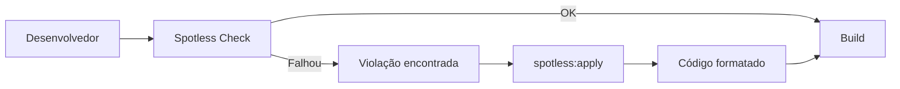

# Spotless

O Spotless é uma ferramenta de formatação de código que garante um padrão de estilo consistente em todo o projeto.

Em vez de cada desenvolvedor utilizar uma configuração diferente da IDE, o Spotless aplica automaticamente as regras definidas pelo projeto durante o build ou sob demanda.

Seu slogan é:

> **Keep your code spotless.**

**Documentação oficial:** https://github.com/diffplug/spotless

---

## Como funciona

O Spotless verifica se os arquivos seguem o padrão de formatação configurado.

O fluxo é o seguinte:

1. O desenvolvedor altera o código.
2. O Spotless compara o código com as regras configuradas.
3. Caso existam diferenças, o build falha.
4. O comando `spotless:apply` corrige automaticamente os arquivos.
5. Após a correção, o código passa na validação.



---

## Benefícios

O Spotless ajuda a manter um padrão único de código em toda a equipe.

Principais vantagens:

- Padroniza a formatação automaticamente.
- Evita discussões sobre estilo de código.
- Reduz diferenças desnecessárias em Pull Requests.
- Facilita revisões de código.
- Pode ser executado localmente ou na CI/CD.
- Suporta diversas linguagens e formatadores.

---

## Comandos Maven

```console
# Verifica se todos os arquivos seguem a formatação configurada.
mvn spotless:check

# Corrige automaticamente todos os arquivos.
mvn spotless:apply
```

---

## Configuração do plugin

Adicione o plugin ao `pom.xml`.

```xml
<!-- Plugin responsável pela formatação automática do código -->
<plugin>

    <groupId>com.diffplug.spotless</groupId>
    <artifactId>spotless-maven-plugin</artifactId>
    <version>${spotless.version}</version>

    <configuration>

        <java>

            <!-- Arquivos que serão formatados -->
            <includes>
                <include>src/main/java/**/*.java</include>
                <include>src/test/java/**/*.java</include>
            </includes>

            <!-- Configuração do Eclipse Formatter -->
            <eclipse>
                <file>${project.basedir}/eclipse-formatter.xml</file>
            </eclipse>

            <!-- Remove código desnecessário -->
            <cleanthat/>

            <!-- Organiza imports -->
            <importOrder/>

            <!-- Remove imports não utilizados -->
            <removeUnusedImports/>

            <!-- Remove espaços em branco no final das linhas -->
            <trimTrailingWhitespace/>

            <!-- Formata anotações -->
            <formatAnnotations/>

            <!-- Garante quebra de linha ao final do arquivo -->
            <endWithNewline/>

        </java>

    </configuration>

    <executions>

        <execution>

            <!-- Executa automaticamente durante o build -->
            <phase>validate</phase>

            <goals>
                <goal>check</goal>
            </goals>

        </execution>

    </executions>

</plugin>
```

---

## Exemplo de utilização

Ao executar:

```bash
mvn spotless:check
```

Caso existam arquivos fora do padrão:

```console
user@machine repo % mvn spotless:check

[ERROR] > The following files had format violations:

src/main/java/com/example/ProductService.java

Run 'mvn spotless:apply' to fix these violations.
```

Execute:

```bash
mvn spotless:apply
```

Resultado:

```console
[INFO] BUILD SUCCESS
```

Depois execute novamente:

```bash
mvn spotless:check
```

Resultado:

```console
[INFO] BUILD SUCCESS
```

---

## Executando durante o desenvolvimento

Durante o desenvolvimento, normalmente utiliza-se o seguinte fluxo:

```bash
# Formata automaticamente
mvn spotless:apply

# Verifica se ainda existe alguma inconsistência
mvn spotless:check

# Executa os testes
mvn test
```

Antes de realizar um commit, é recomendado executar:

```bash
mvn clean verify
```

Como o plugin está configurado na fase `validate`, qualquer violação de formatação fará o build falhar.

---

## Problemas comuns

### Build falhando com "format violations"

Execute:

```bash
mvn spotless:apply
```

para corrigir automaticamente todos os arquivos.

---

### Imports fora de ordem

Verifique se o plugin possui:

```xml
<importOrder/>
```

---

### Imports não utilizados

Verifique se está configurado:

```xml
<removeUnusedImports/>
```

---

### Arquivos não estão sendo formatados

Confira se os diretórios estão incluídos:

```xml
<includes>
    <include>src/main/java/**/*.java</include>
    <include>src/test/java/**/*.java</include>
</includes>
```

---

### Eclipse Formatter

arquivo na raiz eclipse-formatter.xml

```xml
<?xml version="1.0" encoding="UTF-8"?>
<profiles version="23">
    <profile kind="CodeFormatterProfile"
             name="Java25-Clean-Code"
             version="23">

        <!-- Indentação -->
        <setting id="org.eclipse.jdt.core.formatter.tabulation.char" value="space"/>
        <setting id="org.eclipse.jdt.core.formatter.tabulation.size" value="4"/>
        <setting id="org.eclipse.jdt.core.formatter.indentation.size" value="4"/>

        <!-- Linha -->
        <setting id="org.eclipse.jdt.core.formatter.lineSplit" value="100"/>
        <setting id="org.eclipse.jdt.core.formatter.join_wrapped_lines" value="true"/>

        <!-- Chaves -->
        <setting id="org.eclipse.jdt.core.formatter.brace_position_for_type_declaration"
                 value="end_of_line"/>
        <setting id="org.eclipse.jdt.core.formatter.brace_position_for_method_declaration"
                 value="end_of_line"/>
        <setting id="org.eclipse.jdt.core.formatter.brace_position_for_constructor_declaration"
                 value="end_of_line"/>
        <setting id="org.eclipse.jdt.core.formatter.brace_position_for_block"
                 value="end_of_line"/>
        <setting id="org.eclipse.jdt.core.formatter.brace_position_for_switch"
                 value="end_of_line"/>

        <!-- Espaços -->
        <setting id="org.eclipse.jdt.core.formatter.insert_space_before_opening_brace_in_method_declaration"
                 value="insert"/>
        <setting id="org.eclipse.jdt.core.formatter.insert_space_before_opening_brace_in_type_declaration"
                 value="insert"/>
        <setting id="org.eclipse.jdt.core.formatter.insert_space_before_opening_brace_in_block"
                 value="insert"/>

        <!-- Linhas em branco -->
        <setting id="org.eclipse.jdt.core.formatter.blank_lines_after_package"
                 value="1"/>
        <setting id="org.eclipse.jdt.core.formatter.blank_lines_after_imports"
                 value="1"/>
        <setting id="org.eclipse.jdt.core.formatter.blank_lines_before_method"
                 value="1"/>
        <setting id="org.eclipse.jdt.core.formatter.blank_lines_between_type_declarations"
                 value="1"/>

        <!-- Else if -->
        <setting id="org.eclipse.jdt.core.formatter.compact_else_if"
                 value="true"/>
        <setting id="org.eclipse.jdt.core.formatter.insert_new_line_before_else_in_if_statement"
                 value="do not insert"/>
        <setting id="org.eclipse.jdt.core.formatter.insert_new_line_before_catch_in_try_statement"
                 value="do not insert"/>
        <setting id="org.eclipse.jdt.core.formatter.insert_new_line_before_finally_in_try_statement"
                 value="do not insert"/>

        <!-- Streams / builders -->
        <setting id="org.eclipse.jdt.core.formatter.alignment_for_arguments_in_method_invocation"
                 value="16"/>
        <setting id="org.eclipse.jdt.core.formatter.alignment_for_selector_in_method_invocation"
                 value="16"/>
        <setting id="org.eclipse.jdt.core.formatter.alignment_for_parameters_in_method_declaration"
                 value="16"/>

        <!-- Operadores -->
        <setting id="org.eclipse.jdt.core.formatter.wrap_before_binary_operator"
                 value="true"/>

        <!-- Anotações -->
        <setting id="org.eclipse.jdt.core.formatter.insert_new_line_after_annotation_on_method"
                 value="insert"/>
        <setting id="org.eclipse.jdt.core.formatter.insert_new_line_after_annotation_on_type"
                 value="insert"/>
        <setting id="org.eclipse.jdt.core.formatter.insert_new_line_after_annotation_on_field"
                 value="insert"/>

        <!-- Comentários -->
        <setting id="org.eclipse.jdt.core.formatter.comment.format_javadoc_comments"
                 value="true"/>
        <setting id="org.eclipse.jdt.core.formatter.comment.format_block_comments"
                 value="true"/>
        <setting id="org.eclipse.jdt.core.formatter.comment.format_line_comments"
                 value="true"/>
        <setting id="org.eclipse.jdt.core.formatter.comment.line_length"
                 value="100"/>

        <!-- Formatter on/off -->
        <setting id="org.eclipse.jdt.core.formatter.use_on_off_tags"
                 value="true"/>
        <setting id="org.eclipse.jdt.core.formatter.disabling_tag"
                 value="@formatter:off"/>
        <setting id="org.eclipse.jdt.core.formatter.enabling_tag"
                 value="@formatter:on"/>
    </profile>
</profiles>
```

---

## Pipeline típica

```bash
mvn clean verify
```

Fluxo:


---

## Referências

- https://github.com/diffplug/spotless
- https://github.com/diffplug/spotless/tree/main/plugin-maven